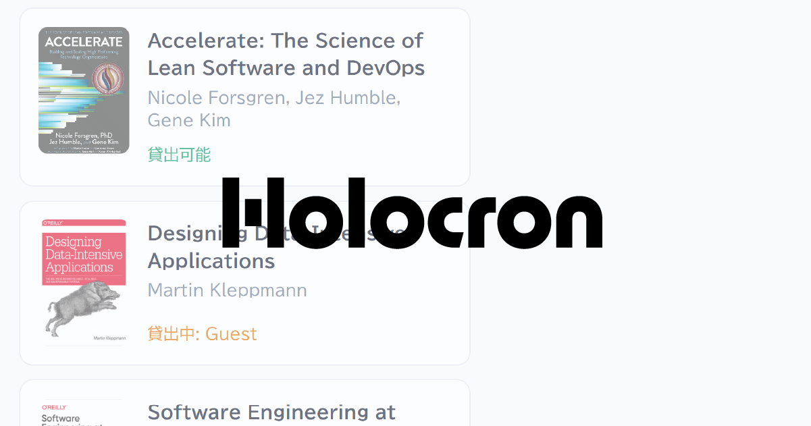

# holocron



A library management application

## Features

- Book registration via ISBN barcode scanning or manual input
- Lending and returning books with barcode scanning
- Book search by title and author
- Lending status tracking with borrower information
- Book deletion with reason tracking (audit trail preserved)
- Firebase Anonymous authentication with customizable usernames

## Architecture

```
┌──────────┐    ┌──────────┐    ┌──────────┐
│   Web    │───▶│  Server  │───▶│  SQLite  │
│ Next.js  │◀───│    Go    │◀───│          │
└──────────┘    └──────────┘    └──────────┘
                     │
              ┌──────┴──────┐
              │  Firebase   │
              │ (Anonymous  │
              │    Auth)    │
              └─────────────┘
```

## Development

Using Visual Studio Code Dev Container is recommended for development.

### Server

Code generation (OpenAPI + sqlc):

```bash
server$ make generate
```

Run the server:

```bash
server$make run
```

### Web

```bash
cd web
```

Code generation (OpenAPI):

```bash
web$ npm run generate:openapi
```

Run the development server. [Stoplight Prism](https://github.com/stoplightio/prism) is available as a mock API server.

```bash
web$ npm run dev
```

### Testing

API tests:

See [api-tests/README.md](api-tests/README.md).

### Observability

Jaeger UI for distributed tracing: http://localhost:16686

## Environment

### Server
- Go 1.25
- oapi-codegen
- sqlc
- SQLite
- Firebase Admin SDK


### Web
- Next.js 16 (App Router)
- Firebase Auth
- Tailwind CSS

### API Tests
- Python / uv
- pytest

## License

[MIT License](LICENSE)

## Author

[toms74209200](https://github.com/toms74209200)
